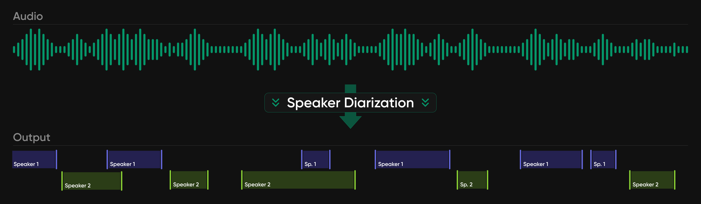

## 💚 Simply detect, segment, label, and separate speakers in any language 

<div align="center">
  <a href="https://github.com/pyannote/pyannote-audio"></a>
  <a href="https://hf.co/pyannote"></a>
  <a href="https://discord.gg/4cjCJcZv"></a>
  <a href="https://www.linkedin.com/company/pyannoteai/"></a>
  <a href="https://x.com/pyannoteAI"></a><br/>
  <a href="https://dashboard.pyannote.ai/"></a> 
  <a href="https://docs.pyannote.ai/"></a> 

</div>

### 🎤 What is speaker diarization?



**Speaker diarization** is the process of automatically partitioning the audio recording of a conversation into segments and labeling them by speaker, answering the question **"who spoke when?"**. As the **foundational layer of conversational AI**, speaker diarization provides high-level insights for human-human and human-machine conversations, and unlocks a wide range of downstream applications: meeting transcription, call center analytics, voice agents, video dubbing.

### ▶️ Getting started

Install [`pyannote.audio`](https://github.com/pyannote/pyannote-audio) latest release available from  with either `uv` (recommended) or `pip`:

```bash
$ uv add pyannote.audio
$ pip install pyannote.audio
```

Enjoy state-of-the-art speaker diarization:

```python
# download pretrained pipeline from Huggingface
from pyannote.audio import Pipeline
pipeline = Pipeline.from_pretrained('pyannote/speaker-diarization-community-1', token="HUGGINGFACE_TOKEN")

# perform speaker diarization locally
output = pipeline('/path/to/audio.wav')

# enjoy state-of-the-art speaker diarization
for turn, speaker in output.speaker_diarization:
    print(f"{speaker} speaks between t={turn.start}s and t={turn.end}s")
```

Read [`community-1` model card](https://hf.co/pyannote/speaker-diarization-community-1) to make the most of it.


### 🏆 State-of-the-art models

[`pyannoteAI`](https://www.pyannote.ai/) research team trains cutting-edge speaker diarization models, thanks to [**Jean Zay**](http://www.idris.fr/eng/jean-zay/) 🇫🇷 supercomputer managed by [**GENCI**](https://www.genci.fr/) 💚. They come in two flavors:

* [`pyannote.audio`](https://github.com/pyannote/pyannote-audio) open models available on [Huggingface](https://hf.co/pyannote) and used by 140k+ developers over the world ;
* premium models available on [`pyannoteAI` cloud](https://dashboard.pyannote.ai) (and on-premise for enterprise customers) that provide state-of-the-art speaker diarization as well as additional enterprise features.

| Benchmark (last updated in 2025-09) | <a href="https://hf.co/pyannote/speaker-diarization-3.1">`legacy` (3.1)</a>| <a href="https://hf.co/pyannote/speaker-diarization-community-1">`community-1`</a> | <a href="https://docs.pyannote.ai">`precision-2`</a> | 
| --------------------------------------------------------------------------------------------------------------------------- | ------------------------------------------------------ | -------------------------------------------------| ------------------------------------------------ |
| [AISHELL-4](https://arxiv.org/abs/2104.03603)                                                                               | 12.2 | 11.7 | 11.4 🏆 |
| [AliMeeting](https://www.openslr.org/119/) (channel 1)                                                                      | 24.5 | 20.3 | 15.2 🏆|
| [AMI](https://groups.inf.ed.ac.uk/ami/corpus/) (IHM)                                                                        | 18.8 | 17.0 | 12.9 🏆|
| [AMI](https://groups.inf.ed.ac.uk/ami/corpus/) (SDM)                                                                        | 22.7 | 19.9 | 15.6 🏆 |
| [AVA-AVD](https://arxiv.org/abs/2111.14448)                                                                                 | 49.7 | 44.6 | 37.1 🏆 |
| [CALLHOME](https://catalog.ldc.upenn.edu/LDC2001S97) ([part 2](https://github.com/BUTSpeechFIT/CALLHOME_sublists/issues/1)) | 28.5 | 26.7 | 16.6 🏆 |
| [DIHARD 3](https://catalog.ldc.upenn.edu/LDC2022S14) ([full](https://arxiv.org/abs/2012.01477))                             | 21.4 | 20.2 | 14.7 🏆 |
| [Ego4D](https://arxiv.org/abs/2110.07058) (dev.)                                                                            | 51.2 | 46.8 | 39.0 🏆 |
| [MSDWild](https://github.com/X-LANCE/MSDWILD)                                                                               | 25.4 | 22.8 | 17.3 🏆 |
| [RAMC](https://www.openslr.org/123/)                                                                                        | 22.2 | 20.8 | 10.5 🏆 |
| [REPERE](https://www.islrn.org/resources/360-758-359-485-0/) (phase2)                                                       | 7.9  |  8.9 |  7.4 🏆 |
| [VoxConverse](https://github.com/joonson/voxconverse) (v0.3)                                                                | 11.2 | 11.2 |  8.5 🏆 |

__[Diarization error rate](http://pyannote.github.io/pyannote-metrics/reference.html#diarization) (in %, the lower, the better)__

### ⏩️ Going further, better, and faster

[`precision-2`](https://www.pyannote.ai/blog/precision-2) premium model further improves accuracy, processing speed, as well as brings additional features.

| Features | <a href="https://hf.co/pyannote/speaker-diarization-community-1">`community-1`</a> | <a href="https://docs.pyannote.ai">`precision-2`</a> |
| -------------- | ----------- | ----------- | 
| Set exact/min/max number of speakers | ✅ | ✅ |
| Exclusive speaker diarization (for transcription) | ✅ | ✅ |
| Segmentation confidence scores | ❌ | ✅ |
| Speaker confidence scores | ❌ | ✅ |
| Voiceprinting | ❌ | ✅ |
| Speaker identification | ❌ | ✅ |
| Time to process 1h of audio (on H100) | 37s | 14s |


Create a [`pyannoteAI`](https://dashboard.pyannote.ai) account, change one line of code, and enjoy free cloud credits to try [`precision-2`](https://pyannote.ai/blog/precision-2) premium diarization:

```python
# perform premium speaker diarization on pyannoteAI cloud
pipeline = Pipeline.from_pretrained('pyannote/speaker-diarization-precision-2', token="PYANNOTEAI_API_KEY")
better_output = pipeline('/path/to/audio.wav')
```
